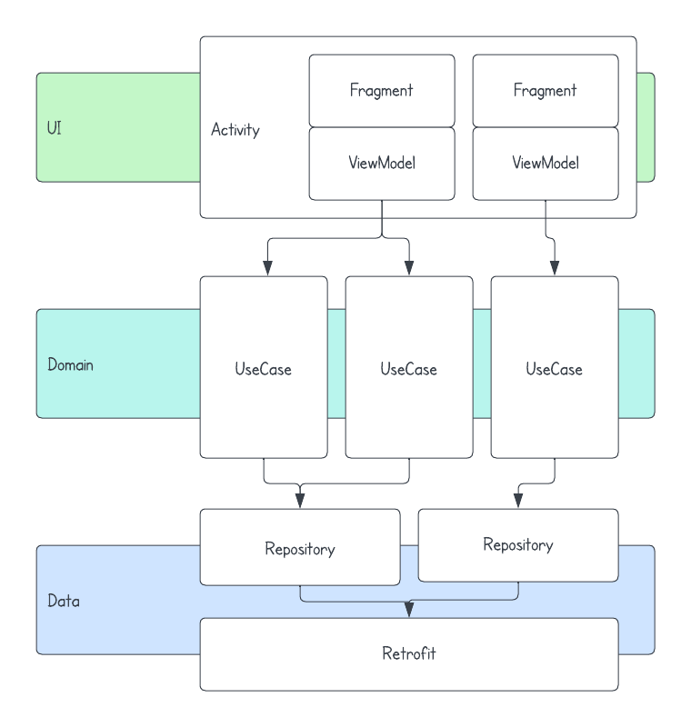

<h1 align="center">
    Android manual dependency injection sample
     
    
</h1>

Want to try it out?
 
The latest APK file is available on the [releases page](https://github.com/cemtuver/android-manualdi/releases).

<table>
    <tr>
        <td>
            

                
            

        </td>
        <td>
            

                
            

        </td>
    </tr>
</table>

## Features
- List/view Rick and Morty characters from [The Rick and Morty API](https://rickandmortyapi.com/)
- Display character names and pictures

## App architecture
<table>
    <tr>
        <td>
            <b>UI layer</b>
            <ul>
                <li>Fragments with single activity</li>
                <li>ViewModel</li>
                <li>LiveData</li>
                <li>Paging3</li>
                <li>Navigation</li>
                <li>Glide</li>
            </ul>
            <b>Domain layer</b>
            <ul>
                <li>UseCase</li>
            </ul>
            <b>Data layer</b>
            <ul>
                <li>Retrofit</li>
            </ul>
            <b>Architectural components</b>
            <ul>
                <li>Kotlin</li>
                <li>Coroutines</li>
                <li>Manual DI</li>
            </ul>
            <b>Testing</b>
            <ul>
                <li>Junit4</li>
                <li>Mockk</li>
            </ul>
        </td>
        <td>
            
        </td>
    </tr>
</table>

## Manual dependency injection
Manual dependency injection is an approach to managing dependencies in Android applications that involves manually creating and managing objects instead of relying on a framework or library such as Dagger and Hilt to do it for you.

### Benefits
* Greater control: With manual dependency injection, developers have greater control over their code and can make changes more easily without having to update or modify a dependency.

* Simpler testing: Manual dependency injection makes it easier to write unit tests for individual components of an application since developers can easily mock dependency modules when testing.

* Better performance: Manual dependency injection can lead to better performance since it avoids the overhead of a framework or library.

* Easier to understand: Unlike some dependency injection frameworks that require developers to learn and use a specific library, manual dependency injection can be done with pure Java or Kotlin code, which most Android developers are already familiar with.

* Modular design: Manual dependency injection encourages a more modular design since dependencies are explicitly defined, making it easier to refactor components without affecting other parts of the application.

### Drawbacks
* Not suitable for all projects: Manual dependency injection may not be the best approach for all projects. For instance, projects with a large number of dependencies may benefit from using a framework or library to manage dependencies.

* Lack of automatic scoping. In some dependency injection frameworks, dependencies can be automatically scoped to certain lifecycle events or contexts, such as a specific activity or fragment. With manual dependency injection, developers must manually manage the scoping of dependencies, which can become complex and error-prone, especially in larger projects. This can lead to potential memory leaks or performance issues if dependencies are not properly scoped. It's important for developers using manual dependency injection to carefully manage the scoping of dependencies to ensure the stability and performance of their application.

## How manual dependency injection works
TBC